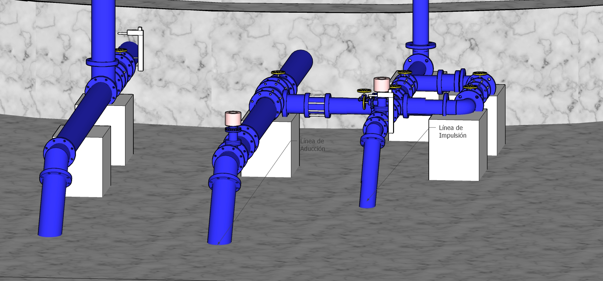

<b>PORTAFOLIO</b>

<b>MODELAMIENTO</b>
 

***

[Regresar al portafolio](../portfolio.html)

Se presentan algunos proyectos relacionados a la capacidad de modelar infraestructura, tanto con fines de análisis, como con fines arquitectónicos y/o didácticos. En estos incisos se recalca el empleo de diversos softwares como ETABS, Revit y SketchUp. Al final de cada entrada se encuentra el archivo de descarga referente.

A continuación, una muestra de los proyectos realizados:

***

# Reservorio apoyado Sedapal
### Modelo tridimensional SketchUp

> Realizado como parte del curso **Tecnología de la Construcción I** durante el cuarto ciclo en la facultad de Ingeniería Civil de la **Universidad Nacional de Ingeniería**.

Elaborado como material didáctico para representar el proceso constructivo de un reservorio apoyado. Esta infraestructura pertenece a un proyecto de ampliación del servicio de agua potable y alcantarillado en las nuevas habilitaciones Sargento Lores, ubicadas en el distrito de San Juan de Lurigancho en Lima. El reservorio cuenta con una capacidad de 150 m3. El modelamiento se realizó en el software SketchUp a partir de los planos de arquitectura e instalaciones hidráulicas que fueron extraídos del expediente. En este proyecto se aprendió el manejo del software, así como se empezó a desarrollar un flujo de trabajo que mejore la eficiencia y orden al modelar en esta plataforma.

### Vista principal

### Vista superior

### Tuberías modeladas

  chane
[Descargar modelo (.skp)](https://drive.google.com/file/d/16c-r-oJR_xGFfoNYZFURUkzzAMC0BUdY/view?usp=sharing)

***

